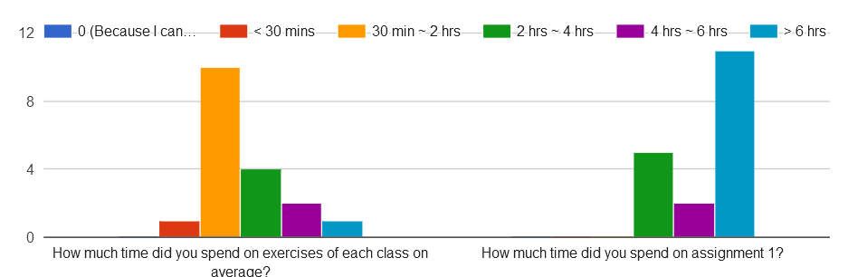
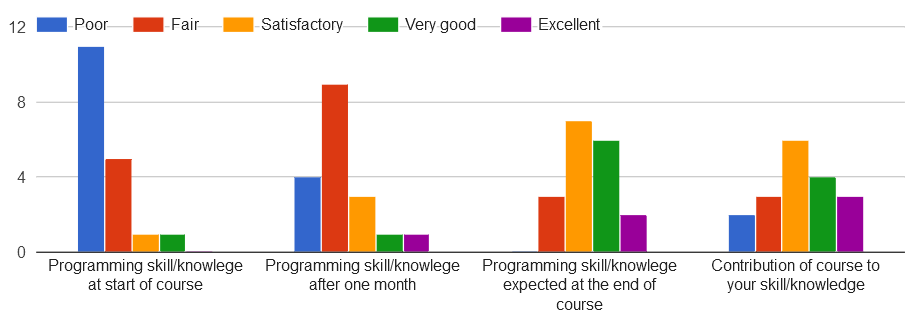

# First Month Feedback

##1. Key stats:
### 1.1 How much time did you spend on exercises of each class onaverage?

### 1.2 Contribution to learning

### 1.3 others

##2. What are three interesting/funny/cool things of taking this course?
- The squirrel shooter, class interactions are fun, and Python is super useful
- import antigravity, python challenge, and github
- Three interesting things about taking this course is it is a lot harder than I thought it would be, I didn't expect it to be so much math, and I think the turtle function is really cool. 
- Satisfaction of getting a code right, application to real world, classroom environment
- Learning to speak the language of computers
- coding is interesting/term project/course is really effective
- I will be a beginner in coding hopefull
- The fact that we are learning such a useful language.  
- 1) finding new ways to solve problems 2) the videos that we watch at the start of class 3) going through the examples of coding bat at the beginning of class as a warm up
- Learn code, useful videos, 
- Professor Li has a neat sense of humor; he introduced me to Slack, which I like very much based on the few times I've used it thus far; Prof. Li is very good at solving problems with downloading, installing and setting specific preferences for applications installed on the computer.
- 1) I feel like after assignment 1, I can really code basic functions and formulas. 2) I realized that coding is nothing like any other business course at Babson. You need to put time and thought into the work - this is not something you can do in the last minute. 3) I think I could make tic tac toe! :)
- Python, Python, and Python
- Learning Python, Learning to design games, Learning to implement search algorithms
- learning visual studio, memes, atmosphere
- You learn python, You get a new way of thinking, you learn to build algorithms
- learn Python, data mine, experience with new language
- We get to learn python!! 

##3. How would we improve this course? 
- More clarity in explanations of code

- Have a workshop on translating logic to python code. Python is on the language for people who overthink, so translating thoughts to the Python syntax is very difficult.

- I would improve this course by moving through the material a lot slower and spending more time on each function and exercise.
 
- more explanation and physical handouts of material

- Dont lecture the entire time... have us do assignments in class and walk around and explain how to do them rather than pushing us out the door at the end of class and saying good luck hand it in midnight tomorrow.

- I would follow the professor on the course, and finished all the activities and assignment.

- Go slower, and teach more without assuming students all know the same amount about a specific topic, maybe have an optional beginner intro course that you take online before the first class(over summer break or over winter break)

- I know its not really your say, but this classroom isnt every helpful. If we had a different class with more width space I think it would enhance learning. 

- I believe that there are certain structures that need to be further broken down and explained. I can understand what the question is asking, and most of the time I can understand how to break it down into the context of code, but I often struggle to write the code itself because of various structural issues. I would start again with more of the coding bat exercises to understand the different functions that Python can perform and develop that into more complex situations. I feel that sometimes we are moving too fast to fully understand what we did last class, and it can be hard to learn this all by ourselves because of the lack of clear communication from the output explaining the problem.
 

- Maybe have  a clear layout of how we're going to proceed.

- Beginning the course with a more fundamental understanding of how code works (ex: explaining what an argument is, what a "for" loop is, what code is used for, examples of common mistakes, examples of its powerful abilities) 

- I would improve this course by having "labs." Wellesley College's intro to CS course has weekly assignments, which are labs. The professor will randomly make groups of two students to complete this lab every week. These weekly assignments consist of the materials you learned and also challenge you. The types of questions that are asked in labs are very similar to what you would get from Assignment 1. The point of these labs are two folds: 1) To force you to develop a level of accountability to do the homework 2) It builds a community within the course to build and develop your coding knowledge together as a group. I truly believe this will force us to do the homework and really appreciate Python for one another. 
 
    Lastly, I believe it would be helpful for us to walk through a python script, have students walk through the script and have him write on the projector. then he should challenge us by asking us how we can improve the script or how else we can solve that issue. Quality of problems > quantity of problems for sure. I'd rather be working on one long problem that encompasses the class learning objectives than 6 throughout a class.

- Make course content more organized and easier to understand

- I think the course is perfect the way it is because it is important to account for the fact that the students in the class will have very different amounts of prior coding knowledge. 

- Would start class with Vocabulary we will learn at the beginning of course (keep it simplistic) the apply it to a problem go line by line (writing it on the board first for simple problems). Know that this is heavy on math but make the math more understandable (most of my problems is trying to understand what the problem is rather than coding). 

- I would make the goals of Python clearer(What are we doing? Why are we doing this? What can we use python to do?). I would also spend more time making sure that students understand what each type of building tool does(what are the differences between a for statement and an if statement? What is the difference between a while loop and a for loop? why do we use recursion?) I would thirdly make sure that we are all on the same page out what we are using python to do. The homework questions do not seem to mirror the level of what we do in class. I liked making the game for assignment 1 but when in class did we learn how to make a game or do anything similar to that. We only learned small parts about the things we can use to make the game but we never learned how to use the pieces together.  

- Teach how to approach problems... I have a step-by-step mentality and have no idea how to even start approaching a coding problem from scratch
 
- less busy work , more (non-graded) exercises on seeing if we can do problems on our own

- The course is fine in regards to even though we do not have to have any knowledge of coding languages, 

- More time spent on building a foundation of coding logic so everyone has a very solid base to build on

- Teach to the middle of the class. Some studnets thoroughly understand Python, while others do not and fall behind.

- Professor Li could improve this course by going alot slower and breaking it down more.

- go slower with more step by step explanation for those who have not coded before

- Less assignments but more in depth explanations on class

- inform us before every quiz

- Not assume everyone has a background in coding and teach instead of just doing the code.  Also go over the in class assignments together either after or before submitting so we have concrete feedback

- Professor I leave the class thinking understand the coding but once I fact assignments I realize I dont. I know its very hard thing to ask but if you could break up that class and make sure everyone is on the same page it would be very helpful. 

- I believe that it would be helpful to fully explain each step before moving forward. Sometimes, we will go through the code of a problem and immediately move on to the next one and I start to fall behind. There has also been a pattern on the homework assignments/ assignment one when the first couple problems are manageable and then there is a huge jump to a much more difficult problem. This can be difficult because it involves putting everything together as well as some code that we may have only briefly touched upon so I have to go back to all my old exercises to review. Even after review, the solutions to the basic questions do not always provide enough information to solve the more complex assignment. I believe that Professor Li should make the assignments reflect the level of difficulty that we have done in class, while providing optional difficult exercises for potential extra credit.

- Take class on a slower pace and focus on student understanding

- Reviewing class exercises/homework in detail at the beginning of each class would be helpful. (Thank you for being so responsive to our questions!)

- Professor Li could improve this course by slowing down during lessons. I feel like every class is extremely rushed and problems aren't being fully explained and solved. I think he should walk us through a Python problem, do a problem with us, and allow us to do these problems with our lab partners. In addition, I think the due dates for python homework should be changed. If labs are not implemented, I would want the full week to work on these python assignments. For example, the homework from tuesday nad thursday should be due on Sunday evening or before the start of next week's courses. This would allow me to really spend time doing the homework. Some students like myself have extremely compact schedules , so we need the weekend to do the work. Lastly, I think there should be different ways of explaining code - I find it extremely helpful when he uses pythontutor.com or visualizes what goes in the code for me to understand whats going on. 

- Provide ppts or handouts that help students learn how to code

- Professor Li could give some optional questions in the in-class exercises that require some extra thinking for the coding bits and allow the students to take the opportunity to teach themselves some code and get better at handling problems using Python.

- na

- Professor Li could focus on making sure that students are not lost while in class. I would suggest having students rate their understanding of a topic by a show of hands and use a scale of 1-5 fingers(1 finger in the air is I don't get it understand 5 is I totally understand) I would also suggest explaining what we use python for more clearly. What do each of the tools we learn do? Why would you use one coding technique vs another? Students get stressed because they feel lost. They are not able to keep up with the code that get's typed. They are trying to type the code and learn at the same time but they get lost and cannot keep up with what is happening. 

- Stop grading us on things you've never touched upon in class...Assign less work / less time-consuming problems (I have learned little because there is always so much work, it is a race to get the assignment done in time.  **** Teach a method to start/approach a problem, don't just keep throwing new content at us.....Improve dull lectures / classtime.....Double check all instructions to make sure there is clear direction and grammar is correct/not confusing

- When given a quiz its over a wide range of subjects we learned and even though they all fall in place together, i do not feel as if i am learning because it is new and we never have a way of a recap in an organized manner after each session. This is why when we have these random quizzes, i am not sure how to answer them because we do not practice answering problems like that often. The teaching style of solely copying everything you do does not help. I wish this were my only difficult class so that i had alot of time to practice on my free time but that is not possible fore everyone.- 